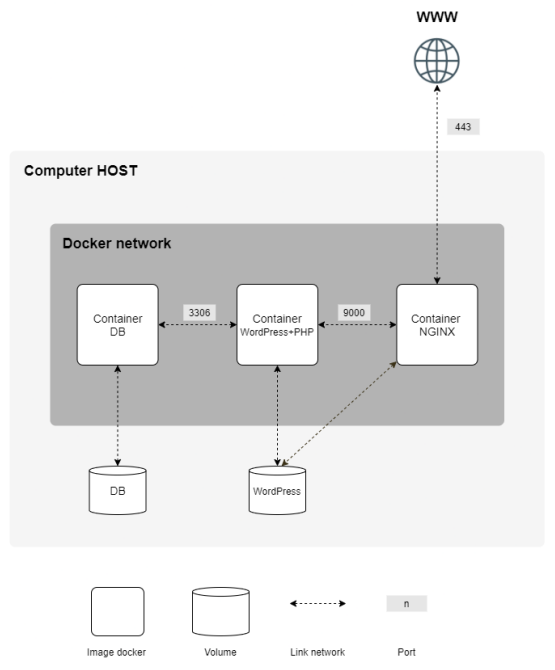

# Inception

`Inception` is designed to create a containerized environment using Docker, allowing students to deploy and manage a multi-service application. The goal is to understand the principles of containerization, orchestration, and service communication.

Score: **100%**

## Features

- Creation of Docker containers for multiple services (Nginx, MariaDB, Wordpress)
- Configuration of a reverse proxy using Nginx
- Implementation of a multi-container application
- Data persistence through Docker volumes
- Networking between containers
- Use of Docker Compose for orchestration

Here is an example, in the form of a diagram, of what should be implemented:



## Prerequisites

This project was made on my own Virtual Machine, in order to try the program you'll need to install:

- [Docker](https://www.docker.com/) 
- [Docker Compose](https://docs.docker.com/compose/) 

## Installation

To use `inception`, simply clone the repository and compile it on your own VM:

   ```bash
   git clone https://github.com/username/inception-42.git
   cd inception-42
   make
   ```

## Usage 

Normally the program should not run because it is missing the `.env` file. This project is not only about IRC, it also train you to think about **security**: you should not put personnal informations as IDs, keys API or env variables.

Configure the services by editing your `.env` file and join it in the `src` folder.
If it still doesn't work, make sure you install all the depedencies.

After all this manipulations, you'll be able to launch the project:
  ```bash
   make
  ```

To access wordpress go in the browser at `https://localhost`

Check the `Makefile` to see the differents commands to manage the containers.
